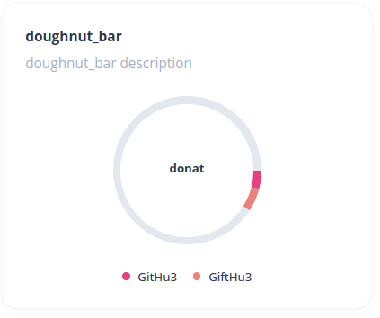
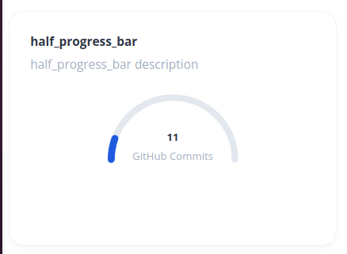
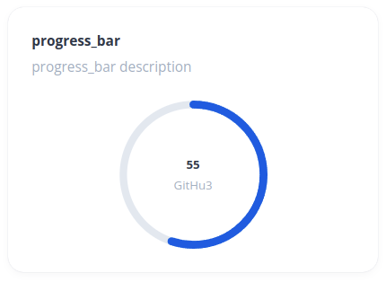
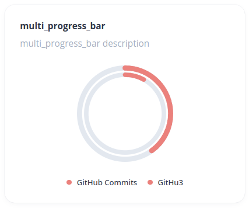
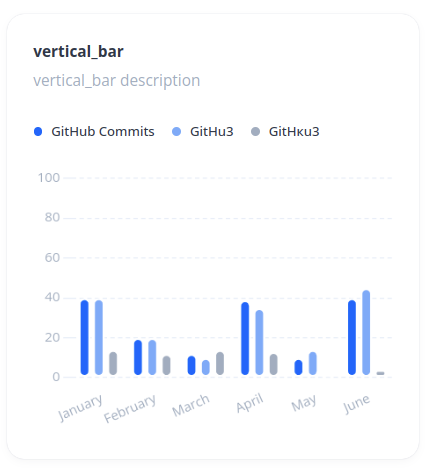
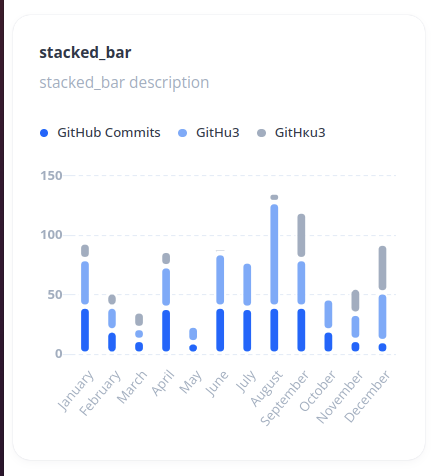
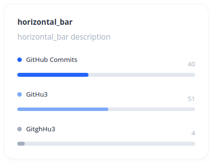
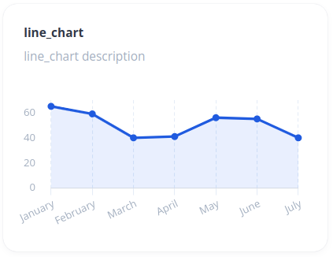
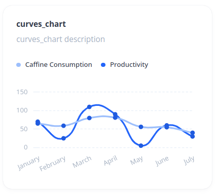

# egal_widget: Charts


Содержит Круговые графики:

- DonatChart - круговая диаграмма с сегментами:



- ProgressChart - круговой график для одного значения




- MultiProgressBar - для двух и более значений



Линейные графики:
- VerticalBarChart - вертикальный график



- StackedBarChart - вертикальный график со столбцами, расположенными "друг на друге"



- HorizontalBarChart - график с горизонтальными столбцами



- Line Chart



- CurvesChart



## Общее
### Использование

 <Chart :data="dataItem" />

[//]: # ( подстраивается под ширину контейнера )

`App.vue`:
````vue
<template>
  <div>
    <Chart :data="dataItem" />
  </div>
</template>

<script lang="ts">
import { defineComponent } from "vue";
import Chart from "@/components/Chart.vue";

export default defineComponent({
  name: "App",
  components: {
    Chart,
  },
});
</script>
````


## Пример вида dataItem
Пример передаваемых данных можно посмотреть в `data.json`


### Конфигурация dataItem

| Параметр      |  Тип   | Обязательный  |          По умолчанию           | Возможные значения                                                                                                                       | Описание                                                                                                                                                                                                                                   |
|---------------|:------:|:-------------:|:-------------------------------:|------------------------------------------------------------------------------------------------------------------------------------------|:-------------------------------------------------------------------------------------------------------------------------------------------------------------------------------------------------------------------------------------------|
| `type`        | String |      да       |        `'vertical_bar'`         | `'doughnut'`, `'half_progress_bar'`, `'progress_bar'`, `'multi_progress_bar'`, `'stacked_bar'`, `'vertical_bar'`, `'horizontal_bar'` | Тип графика.<br/> DonatChart (`'doughnut_bar'`). ProgressChart (`'progress_bar'`). MultiProgressBar (`'multi_progress_bar'`). StackedBarChart (`'stacked_bar'`). BarChart (`'vertical_bar'`). HorizontalBarChart (`'horizontal_bar'`)      |
| `meta`           |   Object    | не для всех графиков | | Объект с данными, необъходимыми для отрисовки и изменения вида кастомных графиков                                                        |
| `title`       | String |      нет      |              `''`               | Любая строка                                                                                                                             | Название графика                                                                                                                                                                                                                           |
| `description` | String |      нет      |              `''`               | Любая строка                                                                                                                             | Описание графика                                                                                                                                                                                                                           |
| `data`        | Object |      да       |              `{}`               |                                                                                                                                          | Объект с данными для отрисовки графиков. Описание необходимых свойств объекта в таблице ниже (Конфигурация data)                                                                                                                           |
| `options`     | Object |      нет      |              `{}`               |                                                                                                                                          | Объект с дополнительных стилей и свойств графика. Описание объекта в таблице ниже (Конфигурация options)                                                                                                                                   |

### Конфигурация data

| Параметр            |      Тип       | Возможные значения                                    | Описание                                                                                    |
|---------------------|:--------------:|-------------------------------------------------------|:--------------------------------------------------------------------------------------------|
| `labels`          |       Array        | `["January", "February", "March"]`                    | Массив лейблов (или пустой массив), которые будут отображаться на оси Х                     |
| `datasets`          |    Array     | Описание представлено ниже в таблице `Конфигурация datasets` | Массив объектов с данными для графика                                                   |    

### Конфигурация datasets

| Параметр            |  Тип   |    Возможные значения     | Описание                                                                                                              |
|---------------------|:------:|:-------------------------:|-----------------------------------------------------------------------------------------------------------------------|
| `label`          | String |     `Some label text`     | Название одного из значений графика (отображается в легенде)                                                          |
| `backgroundColor`          | String |         `#005CE4`         | Цвет значений на графике. Если в этом поле ничего не передано - для первых трех значений подставятся дефолтные цвета  |
| `data`          |   Array    | `[50, 20, 10]` или `[50]` | Массив числовых значений. Если график отрисовывается для одного (напрмер, rogressChart) - передается массив в одним числом |

Для LineChart и CurvesChart также можно передавать следующие параметры:

| Параметр            |   Тип   |                                                 Возможные значения                                                 | Описание                                                                                                                   |
|---------------------|:-------:|:------------------------------------------------------------------------------------------------------------------:|----------------------------------------------------------------------------------------------------------------------------|
| `borderColor`          | String  |                                                     `#005CE4`                                                      | Цвет линии кривой графика                                                                                                  |
| `pointBackgroundColor`          | String  |                                                     `#005CE4`                                                      | Цвет точки на линии                                                                                                        |
| `pointBorderWidth`          | Number  |                                                     `#005CE4`                                                      | Массив числовых значений. Если график отрисовывается для одного (напрмер, rogressChart) - передается массив в одним числом |
| `pointStyle`          | String  | `circle` (по умолчанию), `cross`, `crossRot`, `dash`, `line`, `rect`, `rectRounded`, `rectRot`, `star`, `triangle` | https://www.chartjs.org/docs/master/samples/line/point-styling.html                                                        |
| `pointRadius`          | Number  |                                                 `4` (по умолчанию)                                                 | Радиус точки на линии                                                                                                      |
| `pointHoverRadius`          | Number  |                                                `5`  (по умолчанию)                                                 | Радиус точки на линии при наведении                                                                                        |
| `fill`          | Boolean |                                                       `true`                                                       | Указывает, заливать ли область под графиком цветом (для заливки используется `backgroundColor`)                            |

### Конфигурация options
Объект options отличается для каждого вида графиков.

Для графиков stacked_bar и vertical_bar необхлодимо передавать опции из библиотеки Chart.js (https://www.chartjs.org/). Используется 3 версия библиотеки. Описание того, что можно передавать в опциях, можно найти здесь: https://github.com/chartjs/Chart.js/tree/master/docs

### Примеры данных
Пример данных в формате json - в файле `data.json`. Описание и коммментарии к объектам и их свойствам - в файле `data.ts`
