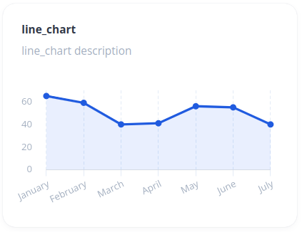
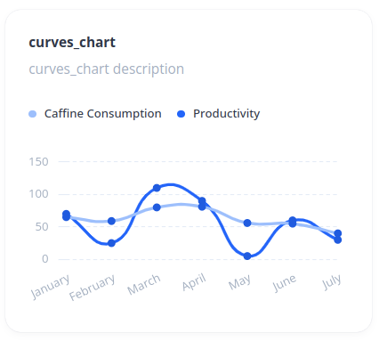

# egal_widget: Charts


Содержит Круговые графики:

- DonatChart - круговая диаграмма с сегментами


- ProgressChart - круговой график для одного значения
 


- MultiProgressBar - для двух и более значений
  

Линейные графики:
- VerticalBarChart - вертикальный график
  

- StackedBarChart - вертикальный график со столбцами, расположенными "друг на друге"


- HorizontalBarChart - график с горизонтальными столбцами
  

- Line Chart
  

- CurvesChart
  

## Общее
### Использование

 <Chart :data="dataItem" />

[//]: # ( подстраивается под ширину контейнера )

`App.vue`:
````vue
<template>
  <div>
    <Chart :data="dataItem" />
  </div>
</template>

<script lang="ts">
import { defineComponent } from "vue";
import Chart from "@/components/Chart.vue";

export default defineComponent({
  name: "App",
  components: {
    Chart,
  },
});
</script>
````


## Пример вида dataItem

````typescript
  {
    "type": "stacked_bar",
        "meta": {
        "borderSkipped": false,
            "enableBorderRadius": true,
            "borderWidth": 2,
            "borderRadius": 10,
            "borderColor": "#fff",
            "width": 11
    },
    "title": "stacked_bar",
        "description": "stacked_bar description",
        "data": {
        "labels": ["January", "February", "March", "April", "May", "June", "July", "August", "September", "October", "November", "December"],
            "datasets": [
            {
                "label": "GitHub Commits",
                "backgroundColor": "#0066FF",
                "data": [40, 20, 12, 39, 10, 40, 39, 40, 40, 20, 12, 11]
            },
            {
                "label": "GitHu3",
                "backgroundColor": "#76ACFB",
                "data": [40, 20, 10, 35, 14, 45, 39, 88, 40, 27, 22, 41]
            },
            {
                "label": "GitHкu3",
                "backgroundColor": "#A0AEC0",
                "data": [14, 12, 14, 13, 1, 4, 3, 8, 40, 2, 22, 41]
            }
        ]
    },
    "options": {
        "legend": true,
            "width": 327,
            "height": 243,
            "scales": {
            "x": {
                "stacked": true,
                    "display": true,
                    "grid": {
                    "display": false,
                        "drawBorder": false
                },
                "ticks": {
                    "font": {
                        "size": 12,
                            "family": "Open Sans"
                    },
                    "padding": 4,
                        "color": "#A0AEC0"
                }
            },
            "y": {
                "stacked": true,
                    "grid": {
                    "display": true,
                        "drawBorder": false,
                        "borderDash": [4, 3],
                        "zeroLineBorderDash": [4, 3],
                        "color": "#E4ECF7"
                },

                "ticks": {
                    "color": "#A0AEC0",
                        "font": {
                        "size": 12,
                            "family": "Open Sans",
                            "weight": "bold"
                    },

                    "maxTicksLimit": 6,
                        "minTicksLimit": 6,
                        "min": 0,
                        "max": 100,
                        "padding": 0
                }
            }
        }
    }
}
````


### Конфигурация dataItem

| Параметр      |  Тип   | Обязательный  |          По умолчанию           | Возможные значения                                                                                                                       | Описание                                                                                                                                                                                                                                   |
|---------------|:------:|:-------------:|:-------------------------------:|------------------------------------------------------------------------------------------------------------------------------------------|:-------------------------------------------------------------------------------------------------------------------------------------------------------------------------------------------------------------------------------------------|
| `type`        | String |      да       |        `'vertical_bar'`         | `'doughnut'`, `'half_progress_bar'`, `'progress_bar'`, `'multi_progress_bar'`, `'stacked_bar'`, `'vertical_bar'`, `'horizontal_bar'` | Тип графика.<br/> DonatChart (`'doughnut_bar'`). ProgressChart (`'progress_bar'`). MultiProgressBar (`'multi_progress_bar'`). StackedBarChart (`'stacked_bar'`). BarChart (`'vertical_bar'`). HorizontalBarChart (`'horizontal_bar'`)      |
| `meta`           |   Object    | не для всех графиков | | Объект с данными, необъходимыми для отрисовки и изменения вида кастомных графиков                                                        |
| `title`       | String |      нет      |              `''`               | Любая строка                                                                                                                             | Название графика                                                                                                                                                                                                                           |
| `description` | String |      нет      |              `''`               | Любая строка                                                                                                                             | Описание графика                                                                                                                                                                                                                           |
| `data`        | Object |      да       |              `{}`               |                                                                                                                                          | Объект с данными для отрисовки графиков. Описание необходимых свойств объекта в таблице ниже (Конфигурация data)                                                                                                                           |
| `options`     | Object |      нет      |              `{}`               |                                                                                                                                          | Объект с дополнительных стилей и свойств графика. Описание объекта в таблице ниже (Конфигурация options)                                                                                                                                   |

### Конфигурация data

| Параметр            |      Тип       | Возможные значения                                    | Описание                                                                                    |
|---------------------|:--------------:|-------------------------------------------------------|:--------------------------------------------------------------------------------------------|
| `labels`          |       Array        | `["January", "February", "March"]`                    | Массив лейблов (или пустой массив), которые будут отображаться на оси Х                     |
| `datasets`          |    Array     | Описание представлено ниже в таблице `Конфигурация datasets` | Массив объектов с данными для графика                                                   |    

### Конфигурация datasets

| Параметр            |  Тип   |    Возможные значения     | Описание                                                                                                              |
|---------------------|:------:|:-------------------------:|-----------------------------------------------------------------------------------------------------------------------|
| `label`          | String |     `Some label text`     | Название одного из значений графика (отображается в легенде)                                                          |
| `backgroundColor`          | String |         `#005CE4`         | Цвет значений на графике. Если в этом поле ничего не передано - для первых трех значений подставятся дефолтные цвета  |
| `data`          |   Array    | `[50, 20, 10]` или `[50]` | Массив числовых значений. Если график отрисовывается для одного (напрмер, rogressChart) - передается массив в одним числом |

Для LineChart и CurvesChart также можно передавать следующие параметры:

| Параметр            |   Тип   |                                                 Возможные значения                                                 | Описание                                                                                                                   |
|---------------------|:-------:|:------------------------------------------------------------------------------------------------------------------:|----------------------------------------------------------------------------------------------------------------------------|
| `borderColor`          | String  |                                                     `#005CE4`                                                      | Цвет линии кривой графика                                                                                                  |
| `pointBackgroundColor`          | String  |                                                     `#005CE4`                                                      | Цвет точки на линии                                                                                                        |
| `pointBorderWidth`          | Number  |                                                     `#005CE4`                                                      | Массив числовых значений. Если график отрисовывается для одного (напрмер, rogressChart) - передается массив в одним числом |
| `pointStyle`          | String  | `circle` (по умолчанию), `cross`, `crossRot`, `dash`, `line`, `rect`, `rectRounded`, `rectRot`, `star`, `triangle` | https://www.chartjs.org/docs/master/samples/line/point-styling.html                                                        |
| `pointRadius`          | Number  |                                                 `4` (по умолчанию)                                                 | Радиус точки на линии                                                                                                      |
| `pointHoverRadius`          | Number  |                                                `5`  (по умолчанию)                                                 | Радиус точки на линии при наведении                                                                                        |
| `fill`          | Boolean |                                                       `true`                                                       | Указывает, заливать ли область под графиком цветом (для заливки используется `backgroundColor`)                            |

### Конфигурация options
Объект options отличается для каждого вида графиков.

Для графиков stacked_bar и vertical_bar необхлодимо передавать опции из библиотеки Chart.js (https://www.chartjs.org/). Используется 3 версия библиотеки. Описание того, что можно передавать в опциях, можно найти здесь: https://github.com/chartjs/Chart.js/tree/master/docs 

### Конфигурация тултипов для LineChart и CurvesChart
Для кастомизации стилей тултипов, необходимо внутри объекта `options` передать объект `tooltipStyles` со следующими необязательными свойствами

 
[//]: # ()
[//]: # ()
[//]: # (#### Конфигурация tooltipStyles)

[//]: # (| Параметр          |   Тип   |           Возможные значения            | Описание                                                                                                                                                                                                                         |)

[//]: # (|-------------------|:-------:|:---------------------------------------:|----------------------------------------------------------------------------------------------------------------------------------------------------------------------------------------------------------------------------------|)

[//]: # (| `backgroundColor` | String  |                `#005CE4`                | Цвет фона тултипа                                                                                                                                                                                                                |)

[//]: # (| `textColor`       | String  |                 `#000`                  | Цвет текста                                                                                                                                                                                                                      |)

[//]: # (| `opacity`         | String  |                  `0.5`                  | Прозрачность тултипа                                                                                                                                                                                                             |)

[//]: # (| `fontFamily`      | String  |              `"monospace"`              | font-family текста                                                                                                                                                                                                               |)

[//]: # (| `fontWeight`      | Number  |                  `800`                  | font-weight шрифта                                                                                                                                                                                                               |)

[//]: # (| `fontSize`        | String  |                 `12px`                  | Размер шрифта                                                                                                                                                                                                                    |)

[//]: # (| `lineHeight`      | String  |            `14px` или `120%`            | line-height свойство                                                                                                                                                                                                             |)

[//]: # (| `padding`         | String  |               `10px 20px`               | Отступы контейнера                                                                                                                                                                                                               |)

[//]: # (| `position`        | String  |     `top`, `bottom`, `corner_left`      | Расположение тултипа относительно точки на графике                                                                                                                                                                               |)

[//]: # (| `title`           | Object  | Объект со свойствами `display` и `text` | Заголовок тултипа. По умолчанию будет отображать значение в данной точке по оси X                                                                                                                                                |)

[//]: # (| `title.display`   | Boolean |                 `true`                  | Отображать ли заголовок. Если свойство отстуствует - заголовок будет отображен по дефолту                                                                                                                                        |)

[//]: # (| `title.text`      |  Array  |         `['title1', 'title2']`          | Массив из строк с заголовком для каждой точки на графике. Количество элементов в массиве должно совпадать с элементами из `datasets.data`. Чтобы вывести одинаковый текст для всех точек - нужно передать одно значение в массив |)

[//]: # (| `body`            | Object  | Объект со свойствами `display` и `text` | Заголовок тултипа. По умолчанию будет отображать значение в данной точке по оси Y                                                                                                                                                |)

[//]: # (| `body.display`    | Boolean |                 `true`                  | Отображать ли основной текст. Если свойство отстуствует - текст будет отображен по дефолту                                                                                                                                       |)

[//]: # (| `body.text`       |  Array  |          `['text1', 'text2']`           | Массив из строк с текстом для каждой точки на графике. Количество элементов в массиве должно совпадать с элементами из `datasets.data`. Чтобы вывести одинаковый текст для всех точек - нужно передать одно значение в массив    |)

[//]: # (| `pointMark`       | Object  | Объект со свойствами `display` и `borderRadius` | Стили для отображения цвета линний графика в тултипе &#40;при наведении для точку&#41;                                                                                                                                                   |)

[//]: # (| `pointMark.display`    | Boolean |                 `true`                  | Отображать ли в тултипе цвет наведенного линнии.  Если значение body.text будет false, то и этот элемент отображаться не будет                                                                                                   |)

[//]: # (| `pointMark.borderRadius`       | String  |          `['text1', 'text2']`           | Радиус точки                                                                                                                                                                                                                     |)

### Примеры данных
Пример данных в формате json - в файле `data.json`. Описание и коммментарии к объектам и их свойствам - в файле `data.ts`