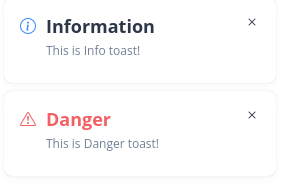

# egal-widgets: Toaster

Плагин уведомлений.

## Подключение плагина

`main.ts`:  
````typescript
import { createApp } from "vue";
import App from "./App.vue";
import EToasterPlugin from "@/plugins/e-toaster-plugin.ts";

createApp(App).use(EToasterPlugin).mount("#app");
````

`App.vue`:
````vue
<template>
  <div>
    <ToasterContainer />
  </div>
</template>

<script lang="ts">
import { defineComponent } from "vue";
import ToasterContainer from "@/components/Toaster/ToasterContainer.vue";

export default defineComponent({
  name: "App",
  components: {
    ToasterContainer,
  },
});
</script>
````

## Использование

````typescript
this.$toaster.info({ message: 'This is Info toast!' });
````
````typescript
this.$toaster.danger({ message: 'This is Danger toast!' });
````


### Конфигурация

Глобальные конфиги устанавливаются через входные параметры компонента `ToasterContainer`

| Параметр            |      Тип       |       По умолчанию       | Возможные значения                                             | Описание                                                                                    |
|---------------------|:--------------:|:------------------------:|----------------------------------------------------------------|:--------------------------------------------------------------------------------------------|
| `position`          |     String     |      `'top-right'`       | `'top-left'`, `'top-right'`, `'bottom-right'`, `'bottom-left'` | Расположение тостера относительно экрана                                                    |
| `reversed`          |    Boolean     |         `false`          | `true`, `false`                                                | Изменяет метод добавления тостов (`true` - добавляет в начало, `false` - добавляет в конец) |
| `duration`          | Number, String |          `3000`          | Любое число                                                    | Длительность отображения тоста                                                              |
| `globalVariant`     |     String     |        `'light'`         | `'light'`, `'dark'`                                            | Цветовая схема тостов                                                                       |
| `globalInfoTitle`   |     String     |     `'Information'`      | Любая строка                                                   | Заголовок тостов типа `info`                                                                |
| `globalInfoIcon`    |     String     |     `'info-circle'`      | Любая иконка, доступная в Bootstrap                            | Иконка тостов типа `info`                                                                   |
| `globalDangerTitle` |     String     |        `'Danger'`        | Любая строка                                                   | Заголовок тостов типа `danger`                                                              |
| `globalDangerIcon`  |     String     | `'exclamation-triangle'` | Любая иконка, доступная в Bootstrap                            | Иконка тостов типа `danger`                                                                 |
| `globalFlat`        |    Boolean     |         `false`          | `true`, `false`                                                | Вид тостов (`true` - тосты в одну строчку)                                                  |

Конфиги для тоста устанавливаются при вызове:
````typescript
this.$toaster.info({
        title: "Info toast!",
        message: "Hi there, I'm Info!",
        variant: "dark",
        flat: true
      });
````

| Параметр                  | Обязательный |   Тип    | Возможные значения                  | Описание                                 |
|---------------------------|:------------:|:--------:|-------------------------------------|:-----------------------------------------|
| `message`                 |    `true`    |  String  | Любая строка                        | Сообщение тоста                          |
| `title`                   |   `false`    |  String  | Любая строка                        | Заголовок тоста                          |
| `icon`                    |   `false`    |  String  | Любая иконка, доступная в Bootstrap | Иконка тоста                             |
| `variant`                 |   `false`    |  String  | `'light'`, `'dark'`                 | Цветовая схема тоста                     |
| `flat`                    |   `false`    | Boolean  | `true`, `false`                     | Вид тоста (`true` - тост в одну строчку) |
| `primaryAction`           |   `false`    |  String  | Любая строка                        | Текст главной кнопки тоста               |
| `primaryActionCallback`   |   `false`    | Function | Любая функция                       | Коллбэк для главной кнопки тоста         |
| `secondaryAction`         |   `false`    |  String  | Любая строка                        | Текст главной кнопки тоста               |
| `secondaryActionCallback` |   `false`    | Function | Любая функция                       | Коллбэк для главной кнопки тоста         |